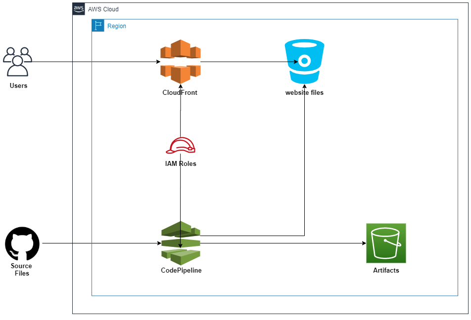

# AWS S3 based website with Terraform 
Creating a CI/CD pipeline for a website on AWS S3 with provisioning required infrastructure.

# Architectural diagram

# Description
Configuration provisions AWS CodePipline's pipeline linked to the specified GitHub repo with the source files that will be deployed on commits to the specified S3 bucket for a website, AWS CloudFront distribution that is pointed to the same S3 bucket and related AWS IAM roles to support required functionality. The output consists of a link to the domain name corresponding to the created AWS CloudFront distribution.  

# Requirements
* AWS account and a user with programmatic access and Admin rights _(required to create IAM roles)_
* Terraform <=0.12.6
* GitHub repo with the website sources  _(can use a sample from a website_sample folder)_. The repo must include __index.html__ file in the root otherwise you need to adjust the code.
* GitHub token to provide at the creation of AWS CodePipelineS3 bucket to host files for the upload to app servers
* All variables that require values are in the __terraform.tfvars__ file

# Notes
* __Provisioned infrastructure will result in costs__
* __Be careful with the AWS credentials and GitHub Tocken__ Do not commit your statement and .tfvars files to public repositories!  
* If you want to be on a safe side and do not destroy created S3 bucket automatically with the terraform destroy command, then assign  __false to force_destroy variable__ .
* Attachment of a custom domain was not included as it is a sample that needs to be convenient for test runs. 
